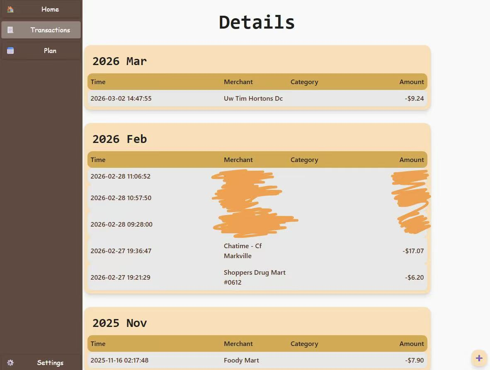
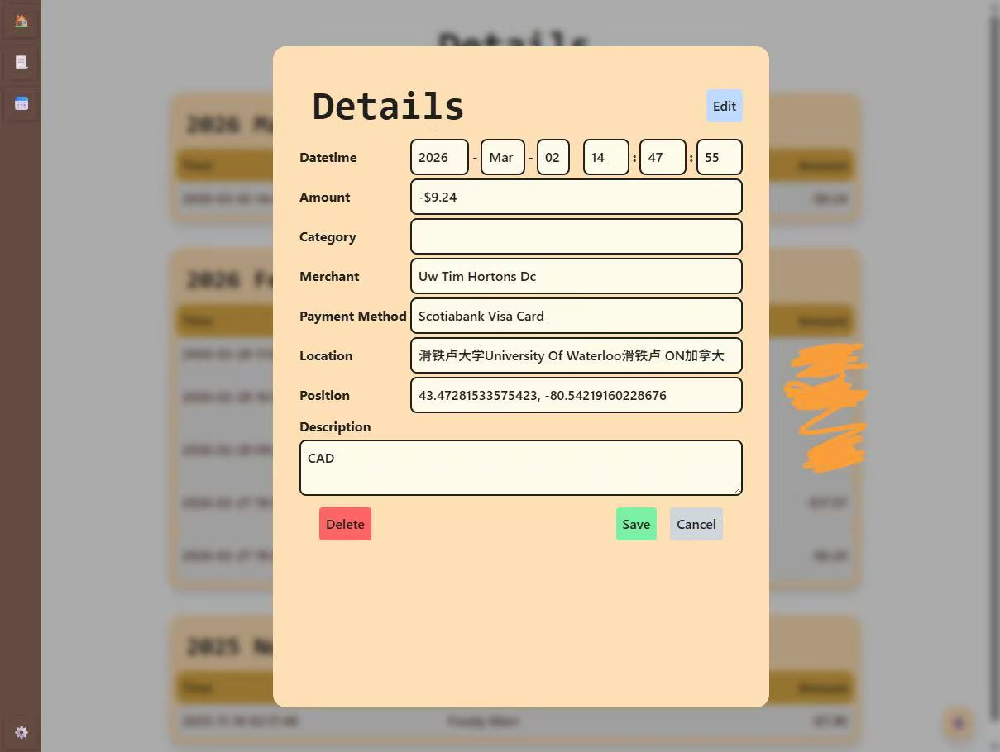

# Financial Management Application (Boom My Wallet)

Link to GitHub Repository: [https://github.com/jianxun-p/Boom-My-Wallet](https://github.com/jianxun-p/Boom-My-Wallet)

Link to Deployed Application: [https://boommywallet.uk.r.appspot.com/](https://boommywallet.uk.r.appspot.com/)

This project is deployed on Google Cloud Platform (GCP) and is a financial management application that allows users to track their expenses. 

<video src="./videos/demo-boommywallet.mp4" style="max-height: 500px;" controls></video>

***Note**: The text is in Chinese because my phone is set to Chinese, but the application supports all languages (including English).*

## Table of Contents
1. [Introduction](#introduction)
2. [Why Another Financial Manager?](#why-another-financial-manager)
3. [Security](#security)
    - [Access Tokens Storage](#access-tokens-storage)
    - [CSRF and XSS Protection](#csrf-and-xss-protection)
4. [Data Storage, Ownership and Privacy](#data-storage-ownership-and-privacy)
5. [UI and Data Visualization](#ui-and-data-visualization)
6. [Automatic Expense Logging](#automatic-expense-logging)
    - [Apple Shortcuts Integration](#apple-shortcuts-integration)

## Why Another Financial Manager?

There are already many financial management applications available in the market, so why did I choose to build another one? The main reason is that many of the existing applications are either **too propertary** and user does not have , which means that they are not **open-source** and may have privacy concerns, or they are too complex for the average user to navigate. I wanted to create a simple application targeted for more technical people that allows users to easily track their expenses without having to worry about the **security and ownership of their data**. 

### Security

The application is designed with security in mind. By using Google Sheets API, the application does not store any user data on its own servers, which means that there is no risk of data breaches or unauthorized access to user data. Additionally, the application uses **OAuth 2.0** with **OpenID-Connect** for authentication, which ensures that only authorized users can access their financial data.

#### Access Tokens Storage

Access tokens are hashed with salt and stored in the Firestore database, which adds an additional layer of security to protect user data. This means that even if the database is compromised, the access tokens cannot be easily used to gain unauthorized access to user data.

The first layer of hashing is done with the SHA-256 algorithm, which is a widely used cryptographic hash function that produces a fixed-size output. It is designed to be fast and efficient, making it suitable for hashing large amounts of data. However, it is not designed to be resistant to brute-force attacks, which is why I added a second layer of hashing with scrypt. This output can also be used to check if the access token has been compromised in a data breach by comparing it against a database of known compromised tokens, such as the one provided by [Have I Been Pwned](https://haveibeenpwned.com/).

The second layer of hashing is done with scrypt, which is a password hashing function that incorporates a salt to protect against rainbow table attacks and is designed to be computationally expensive to prevent mass-scale brute-force attacks.

#### CSRF and XSS Protection

The application also implements protection against **Cross-Site Request Forgery (CSRF)** and **Cross-Site Scripting (XSS)** attacks. CSRF protection is implemented by generating a unique token/ID for each user session that is stored in Cookies (`SameSite=Strict`, `Secure=True`, `HttpOnly=True` with a short expiration time). The server then validates the token to ensure that the request is coming from an authenticated user. XSS protection is achieved by **not processing any user input** on the server side. This means that any user input is treated as plain text and is not executed as code, which helps to prevent XSS attacks. `X-Frame-Options` is also set to `DENY` to prevent **clickjacking attacks**.

### Data Storage, Ownership and Privacy

User's financial data is stored in their own Google Drive (a Google Sheet file), which means that users have full control over their data and can easily export it to other applications for further analysis. The application uses Google Sheets API to read and write data to the user's Google Drive, which ensures that the data is stored securely and is easily accessible to the user.

This also means that users are not stuck with the application if they decide to switch to other solutions, they can easily export their data to other applications or even just keep it in their Google Drive for future reference.

### UI and Data Visualization

The UI of the application is designed to be simple and intuitive. The main page displays a list of all expenses, and users can easily add new expenses by clicking on the "Add Expense" button. Each expense entry includes the amount, payment type, location, and date of the expense. Users can also edit or delete existing expenses by clicking on the corresponding buttons next to each entry.

It is created with React + TypeScript + Tailwind CSS. Originally, I wanted to use recharts to display the data in a more visual way, but I figured that it was not what I needed, Google Sheets already provides a good way to visualize data, and I can easily export the data to Google Sheets for further analysis. The charts created by Google Sheets are much more customizable.

### Automatic Expense Logging

The application exposes an API endpoint that allows users to log expenses automatically by sending a POST request with the expense details in the request body. This feature is particularly useful for users who want to log expenses on the go, such as when they are out shopping or dining at a restaurant. By using this API endpoint, users can quickly and easily log their expenses without having to open the application and manually enter the details.

#### Apple Shortcuts Integration

The API endpoint can be easily integrated with Apple Shortcuts, which allows users to log expenses automatically when an payment is made through Apple Pay. This integration eliminated the need for users to manually log their expenses, making it even more convenient to keep track of their spending. With this feature, users can simply set up a shortcut that triggers the API endpoint whenever they make a payment with Apple Pay, and their expenses will be automatically logged in the application without any additional effort on their part.

