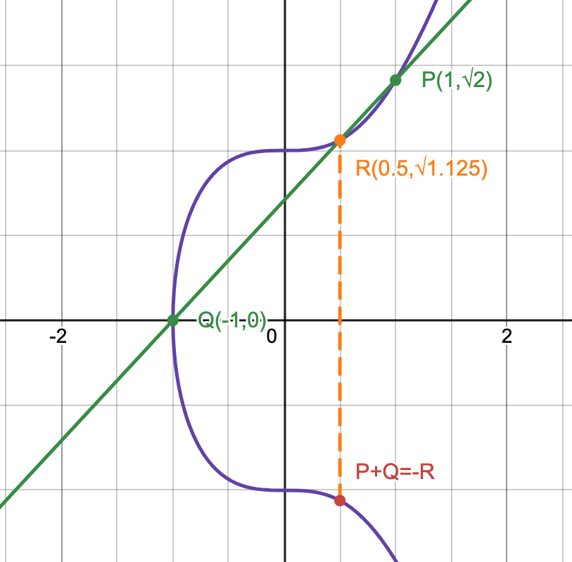
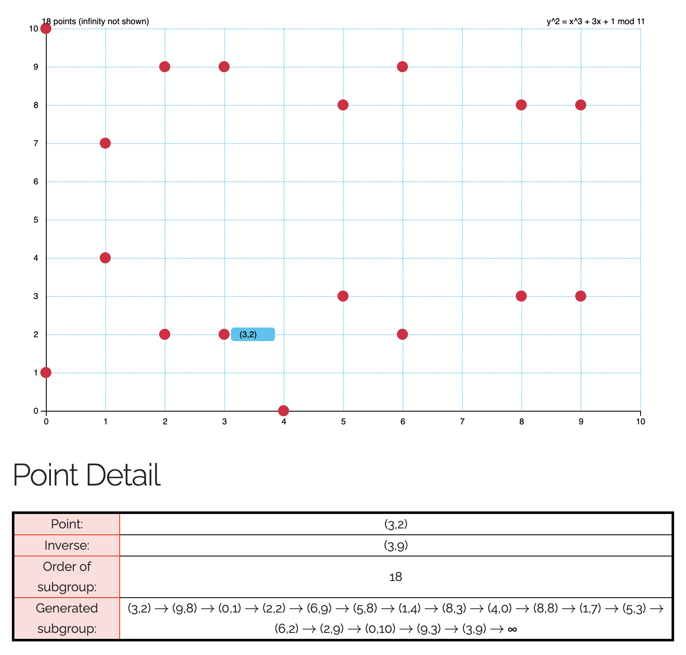

# Elliptic Curve Cryptography (ECC)

## Table of Contents

---

- [Elliptic Curve (EC)](#elliptic-curve-ec)
- [Elliptic Curve over Real Numbers](#elliptic-curve-over-real-numbers)
  - [Point Addition](#point-addition)
  - [Point Multiplication](#point-multiplication)
- [Elliptic Curve over Finite Field](#ec-over-finite-field)
  - [Point Arithmetic over Finite Field](#point-arithmetic-over-finite-field)
  - [Cyclic Group](#cyclic-group)
- [Elliptic Curve in Cryptography](#ec-in-cryptography)
  - [Elliptic-Curve Diffie–Hellman (ECDH)](#elliptic-curve-diffiehellman-ecdh)

## Elliptic Curve (EC)

---

Elliptic curves have the form:

$$y^2=ax^3+bx^2+cx+d$$

**Weierstrass Form**: $y^2 = x^3 + ax + b$

**Montgomery Form**: $by^2 = x^3 + ax^2 + x$

**Twisted Edwards Form**: $ax^2 + y^2 = 1 + dx^2y^2$

All three forms are equivalent, as there exists bijective mapping of any curves between any two forms.

## Elliptic Curve over Real Numbers

---

For some constants $a,b\in\R$, such that $\Delta = 4a^3 + 27b^2 \neq 0$, the set of points on the curve is:
$$E:= \{(x, y): x,y\in\R, y^2 = x^3 + ax + b\}$$

### Point Addition

The sum of points $P(x_1,y_1)$ and $Q(x_2,y_2)$ for elliptic curves is $-R=(x_3,y_3)$, where $-R$ is the reflection over the x-axis of $R$, and $R$ is the intersection point of line $\overline{PQ}$ with the curve. If such point does not exists, then the sum $-R=O$ would be the infinity point.

This operation is commutative, which means that the group $(E,+)$ is an Abelian Group, with the identity being $O$.

Example with the curve $y^2 = x^3 + 1$, $(1,\sqrt{2})+(-1,0)=(0.5,-\sqrt{1.125})$:

**Case $P=O \vee Q=O$**

>There exists only one intersection between the tangent line at $P=Q$ and the curve; hence,
>
> $P=O\implies -R=Q$, and
> 
> $Q=O\implies -R=P$.

**Case $P\neq Q$**

>$-R=(\lambda^2-x_1-x_2, -\lambda^3 + (x_1+x_2)\lambda - c)$, where $\lambda = \frac{y_2-y_1}{x_2-x_1}, c = \frac{y_1x_2-y_2x_1}{x_2-x_1}$.

**Case $P=Q \wedge y \neq 0$**

>$R$ would be the second intersection point of, the tangent line of the curve at $P$. For curve in Weierstrass form, the formula is given as:
>
>$-R=(\lambda^2-x_1-x_2, -\lambda^3 + (x_1+x_2)\lambda - c)$, where $\lambda = \frac{3x^2+a}{2y}, c = \frac{-x^3+ax+2b}{2y}$.

**Case $P=Q \wedge y = 0$**

>$-R=O$, because there exists only one intersection between the tangent line at $P=Q$ and the curve.

### Point Multiplication

Point multiplication is defined to be repeated point addition. Given a point $P$ and an integer $n$, $nP:=\sum_{i=1}^n P$. This could be done efficiently with the double-and-add method.

However, similar to the [index](algebra.md/#multiplicative-order-and-primitive-root-and-index), there is no more efficient method of finding $n$ given $P$ and $nP$ in comparison with repeatedly subtracting $P$ from $nP$.

## EC over Finite Field

---

For some prime modulo $p\in\Z$ and some constants $a,b\in\Z_p$, such that $4a^3 + 27b^2 \not\equiv 0\ (\mathrm{mod}\ p)$, the set of points on the curve is:
$$E:= \{(x, y): x,y\in\Z_m, y^2 \equiv x^3 + ax + b\ (\mathrm{mod}\ p)\}$$

### Point Arithmetic over Finite Field

Point addition over the finite field is similar to [point addition over infinite field](#point-addition), with the exception that all operations are done under modulo $p$, and division becomes modular inverse (always exists since the modulo is a prime).

Point multiplication over the finite field is repeated addition, and also can be computed efficiently with the double-and-add method.

### Cyclic Group

To generate a cyclic group from $E$, choose any point $g\in E$, and construct $\langle g\rangle$. This cyclic group of order $n$ would be a subgroup of $E$. The order of the subgroup depends on the choice of $g$.

*(An [example](https://www.graui.de/code/elliptic2/) of a cyclic group formed)*

## EC in Cryptography

---

ECC is based on elliptic curve over the prime Finite field.

### Elliptic-Curve Diffie–Hellman (ECDH)
