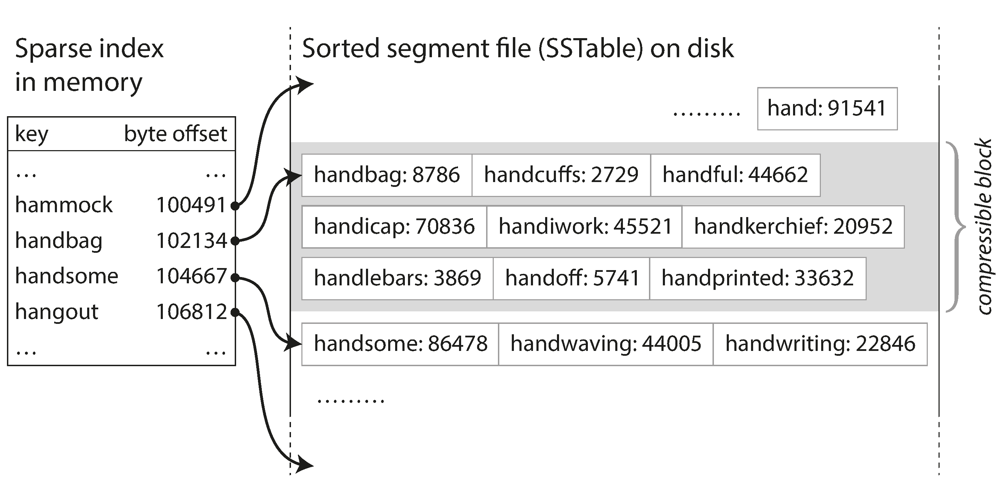

# Designing Data-Intensive Applications

## Table of Contents

1. [Reliability, Scalability & Maintainability](#reliability-scalability--maintainability)
    - [Reliability](#reliability)
    - [Scalability](#scalability)
    - [Maintainability](#maintainability)
2. [Data Models and Query Languages](#data-models-and-query-languages)
    - [Relational, Document, Graph-Like Data Models](#relational-document-graph-like-data-models)
    - [Query Languages](#query-languages)
3. [Storage Engines](#storage-engines)
    - [Simple Log Structures](#simple-log-structure)
    - [Sorted String Table (SSTable) & Log-Structure Merge Tree (LSM-Tree)](#sorted-string-table-sstable--log-structure-merge-tree-lsm-tree)
    - [B-Tree](#b-tree)
    - [Comparison](#comparison)

---

## Reliability, Scalability & Maintainability

### Reliability

The ability to continue to work correctly, even when things go wrong. Reliability measures the degree of fault-resilient. 

- **Fault**: "one component of the system deviating from its spec"
- **Failure**: "the system as a whole stops providing the required service to the user"

### Scalability

It is more accurate to describe the scalability of a system when given specific context (e.g. when certain types of requests increase in number, how does the system behave) instead of "the system scales or the system doesn't scale".

The load parameters are used to describe load, and the system should be design around these parameters. Examples of load parameters: requests per second, the read-write ratio, the number of simultaneously active users in a chat room, the hit rate on a cache, throughput, and etc...

#### Response Time

- **Latency**: the duration that a request is waiting to be handled
- **Response Time**: service time + network delays + queueing delay + etc...

Response time is better described with percentiles than mean (e.g. 99% of the requests are responded within 10ms). High-percentiles (tail latency) are important due to tail latency amplification.

**Tail Latency Amplification**: when making parallel API calls, the response time is determine by the slowest call, so as the number of concurent API calls increases, the expected response time increases non-linearly.

Algorithms to efficiently approximate response time:  forward decay, t-digest, or HdrHistogram.

#### Scaling

- **Vertical Scaling**: More powerful machine (simple but expensive after certain point)
- **Horizontal Scaling**: Distributing load across multiple machines, shared-nothing architecture (complex with stateful services: data syncing and etc...)

There is no magic scaling sauce, everything depends on the load characteristics and the existing constraints.

### Maintainability

- Operability: "Make it easy for operations teams to keep the system running smoothly"
- Simplicity: "Make it easy for new engineers to understand the system, by removing as much complexity as possible from the system"
- Evolvability: "Make it easy for engineers to make changes to the system in the future, adapting it for unanticipated use cases as requirements change. Also known as extensibility, modifiability, or plasticity"

---

## Data Models and Query Languages

### Relational, Document, Graph-Like Data Models

- **Relational Model**: well, SQL...
- **Document Model**: JSON files, etc...
- **Property Graph Model**: Consists of: 
    - Vertex:
        - A unique identifier
        - A set of outgoing edges
        - A set of incoming edges
        - A collection of properties (key-value pairs)
    - Edge:
        - A unique identifier
        - The vertex at which the edge starts (the tail vertex)
        - The vertex at which the edge ends (the head vertex)
        - A label to describe the kind of relationship between the two vertices
        - A collection of properties (key-value pairs)

Comparison between the different data models:


|      | Relational | Document | Property Graph |
| --- | --- | --- | --- |
| Impedance Mismatch  | Need conversion | Minimal | Need conversion |
| One/Many-to-Many Relationships | `join` is easy | Weak support for `join`. Developers had to decide whether to duplicate (denormalize) data or to manually resolve references from one record to another | Capable of handling complex relationships, but weak support for `join` |
| Schema Changes (add/rm fields) | `UPDATE` may be extremely slow, leading to long downtimes | schema-on-read, schema is not enforced by the database | No rigid schema |
| Data Locality | Bad, split accross tables | Good, usually stored as consecutive strings | -

**Impedance Mismatch**: Data stored in database needed translation/conversion to become objects in memory. 

### Query Languages

- Declaritive: SQL
- MapReduce (something in-between): `map`, `filter`, `reduce`/`fold`, etc...
- Imperative

---

## Storage Engines

Consider key-value pairs.

### Simple Log Structure

For writes/changes/deletes, the new/updated data is appended to the end of the file, while the old data is preserved. Results in duplicated keys (if the value of the key is modified), in this case, the most recent value (the one that appears latest in the file) is the valid data.

Compaction can be performed to reduce file size: Deduplication (remove the older versions).

To index this, just use a hash map (key, bytes offset in file).


### Sorted String Table (SSTable) & Log-Structure Merge Tree (LSM-Tree)

Extend the previous [Simple Log Structure](#simple-log-structure).

Consists of segments.

The key-value pairs in each segement is ordered by the key.

When logging a new change to the data (writes/changes/deletes), try appending to the newest segment. If it breaks the ordering of the segment, start a new segment instead.

Compaction can be performed to reduce file size: Merging sorted lists (remove the older versions).


To index a segment, we don't need to index every key, we can use a sparse index. Each segment can be partitioned into blocks, and only index the first key of each block. The segment is sorted, so given a key, we can determine which block it is in using binary search. We can then iterate through all key-value pairs in that block to find the exact value we are looking for.



An additional benefit is that we can now use compression algorithms to compress the blocks when storing them in disk.

If you can't find the key in latest segment, try finding it in the previous one. Repeat until all segments are searched to be sure that it doesn't exists. Or use a bloom filter.

### B-Tree

Well, they're B-trees...

### Comparison

| | Simple Log Structure | SSTable & LSM-Tree | B-Tree |
|--|--|--|--|
| Size On Disk | Big | Compressed | No duplicates, but may results in fragmentation (unfilled pages) |
| Index Size In Memory | Big | Small | Depends on the parameters of the tree |
| Lookup Time | Constant time | Not as good as simple log-structured storage | Good |
| Compaction | Inefficient, the data is not sorted | Efficient, the data is sorted. It only requires sequential reads from disks. | - |
| Crash | Use a write-ahead log to prevent data loss | Use a write-ahead log to prevent data loss | Use a write-ahead log to prevent data loss |
| Concurrency | - | A segement for each thread | Use locks or latches for writing |
| Writes/Changes/Deletes | - | May need to merge the segment several times (several writes to disks) | Write to disk twice (write-ahead log and the actual tree) |
| Throughput | - | Normally higher write throughput | Normally higher read throughput |

---

## Data Encoding

### Data Compatibility

Data should be encoded with compatibility in mind.

**Backward Compatibility**: new code should be able to read old data.
**Forward Compatibility**: old code should be able to read new data (not necessarily all).

Say you add a field to a record schema, and the newer code writes a value for that new field to the database. Subsequently, an older version of the code (which doesn’t yet know about the new field) reads the record, updates it, and writes it back. In this situation, the desirable behavior is usually for the old code to keep the new field intact, even though it couldn’t be interpreted.

Archieve data can be stored with column-oriented formats, which is useful for analytic purposes.

### RPC API

RPC is flawed, it was designed to be similar to local function calls. But local function calls are fundamentally different from remote API calls.

| Local Function Call | Remote API Call |
| --- | --- |
| Halts means success or failure, not halting means it is still proccessing | Recieving a response means success or failure, but no response can mean different things: still processing, the request/response is lost |
| No idempotency problems, behaviour is well defined | Idempotency problems with retries |
| Execution time is predictable | Response time varies |
| Save to pass references/pointers to large objects | Need to send the entire object to the server, and may face problems such as self-referencing objects |

The new generation of RPC frameworks is more explicit about the fact that a remote request is different from a local function call.

### Textual and Binary Formats of Data

JSON, XML and CSV are human readable, but they are in textual format, and they have the following problems:

- there are no type information 
    - JSON: Integers greater than $2^{53}$ cannot be represented accurately
    - XML & CSV: cannot distinguish integers with strings
- no support for binary string
    - inefficient in representing binary strings
- no schema enforcements
- space inefficencies

Once a field tag is assign to some field, even when the field is removed from the schema in the future, the tag cannot be used again for other fields. 

Field tags needed to be assigned manually.

Avro approach the problem with differently, it seperates the schema from the data. 

A schema written in Avro IDL would look like this:

```
record Person {
    string               userName;
    union { null, long } favoriteNumber = null;
    array<string>        interests;
}
```

And the binary data looks like this:


