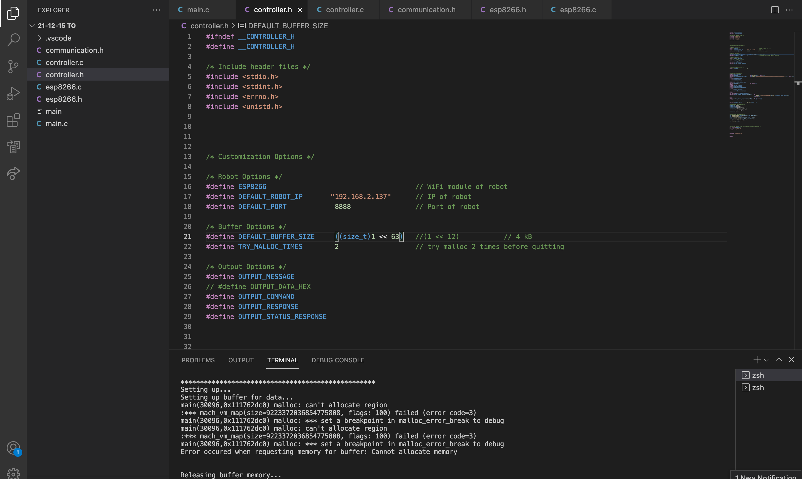
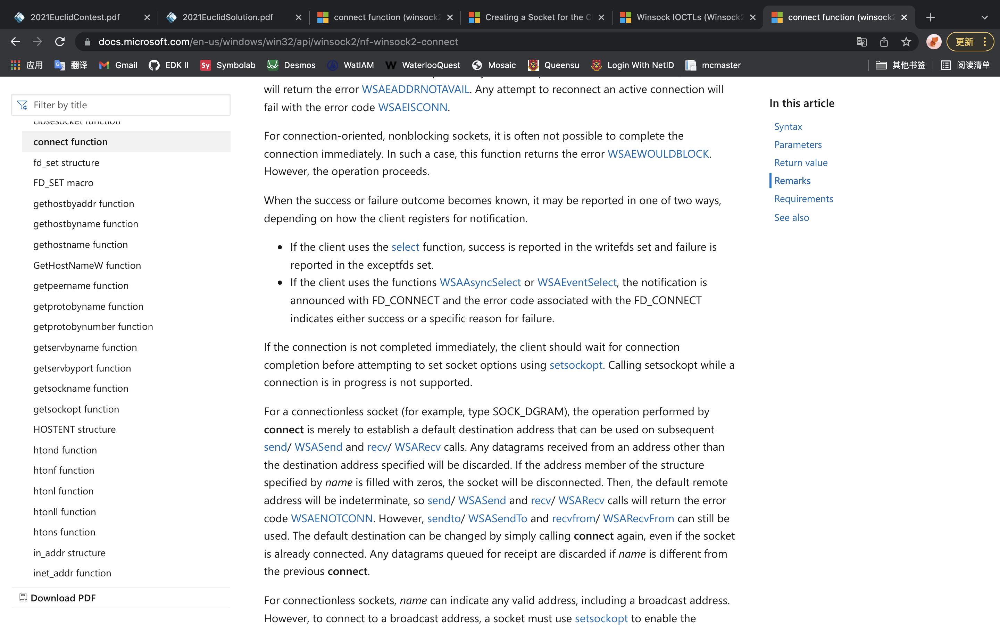
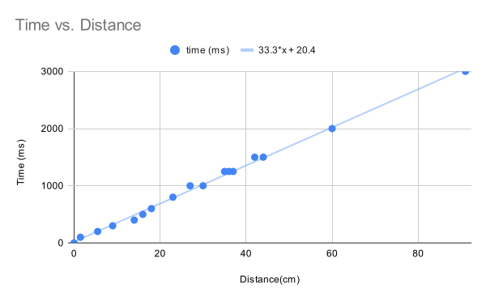

## Table of Contents
---
1. [December 15th, 2021](#log1)
2. [December 16th, 2021](#log2)
3. [December 17th, 2021](#log3)
4. [December 31th, 2021](#log4)
5. [January 10th, 2022](#log5)
6. [January 11th, 2022](#log6)
7. [January 12th, 2022](#log7)
8. [January 13th, 2022](#log8)
9. [January 14th, 2022](#log99)
10. [January 23th, 2022](#log10)
11. [January 24th, 2023](#log11)
12. [January 25th, 2022](#log12)

## Log #1 - December 15th, 2021 
---

### What was done
I downloaded and installed the libraries for the ESP8266, then I tested it with a simple LED blinking code. 

### Brainstorm/Reflection
The importance of device drivers are crucial. They are responsible for the communication between the operating system and the devices. It is impossible to use the full abilities of the devices without the help of the drivers. The basic drivers that UEFI loads during the DXE stage can help operating systems to utilize most devices, but certainly not all, and definitely don’t push the devices to their full capabilities. 

It is important to look at the specifications of the products when purchasing a cable, because some only have two wires inside for power delivery and no wires for data transmission.

### Issues and Fixes
The Arduino IDE was not able to detect the USB port connecting to the ESP8266. So I searched for the driver online and installed it. It still didn’t work. I looked for clues on the internet, and an article suggests that it might be the cable that I was using was a power delivering cable, which is not able to transmit data. So I replaced that cable with another one. The arduino IDE was able to detect the port and upload the code.

### Accomplishments and Next Steps
I tested the ESP8266 with a simple LED blinking code. Next step is to connect it to the WiFi.

## Log #2 - December 16th, 2021 
---

### What was done
I researched about WiFi connections on ESP8266, looked at documentation of the ESP8266 from the official website of the manufacturer, and also found an Arduino library (ESP8266WiFi) online. I wrote some code to connect it to my own WiFi. It scans all the nearby available SSIDs and their signal strength. 

### Brainstorm/Reflection
Using WiFi in this robot is a better choice than bluetooth and wired-controlled. This conclusion stands because of multiple reasons. Firstly, WiFi can provide faster communication between the robot and the controller, which allows more control of advanced sensors and rescue equipment that requires bandwidth. Secondly, using WiFi allows the controller to control multiple robots at the same time which bluetooth does not allow. Thirdly, the ability to connect to WiFi means that the robot can be connected into the internet, which allows distant controls of the robots, unlike bluetooth which would have a significant latency to convert the bluetooth data. Even Though wired robots also have the advantages listed above, the data transmission wires of wired robots might tangle up, which has no benefits in a rescue. On the other hand, bluetooth’s low power consumption is one of its advantages, but the rescue robot is big enough to fit a battery inside. In addition, the ESP8266 can turn off the antenna (the different sleep modes) to save battery.

### Issues and Fixes
No issues today.

### Accomplishments and Next Steps
I tested the ESP8266 by scanning nearby WiFi routers and connecting it to my WiFi. Next step is to make a connection to my computer.

## Log #3 - December 17th, 2021 
---

### What was done
I researched about creating a TCP connection using the ESP8266WiFi library, and wrote some code for the arduino to establish a TCP connection. I wrote some C code on my computer to establish a TCP connection with the robot using sockets. 

### Brainstorm/Reflection
The reason that I chose TCP instead of UDP connection is that I need the commands and data to be transferred in order, and ensure that my commands from the controller (computer) are received by the robot. This is a great advantage in rescue, because oftentimes, the robot is not in sight of the controller, which means that the controller would have a difficult time figuring out which commands are executed or not.

If I am able (if I have time) to put a camera on the robot, I would use a UDP connection for the video data instead. The reasoning behind this is that it is more about speed and latency than the smoothness of the images when it comes to live video connections. If a frame is lost during transmission, simply ignore it. Rescue teams need the newest images instead of the old ones.

### Issues and Fixes
No issues today.

### Accomplishments and Next Steps
I connected the ESP8266 to my computer through a TCP connection. Next step is to control it with my computer.

## Log #4 - December 31th, 2021 
---

### What was done
I configured my VS code for Arduino. I wrote a lot of code for the communication between the controller and the robot. I tested the communication and execution of commands. Then, I had made huge amounts of changes to the code for better communication supporting commands, messages, data etc… 

During the winter break, Henry had typed out the documentation for the summative assignment. In the six hundred words documentation, he briefly mentioned the history of the technology, current and future applications and technology, as well as the possible improvements. 

### Brainstorm/Reflection
The choice of IDE is important in a project, especially in a large project. The coder (me) had to spend most of my time with the IDE to code. An efficient IDE would save a lot of time and energy. The Arduino IDE had a very limited amount of functionalities compared to VS code. I found it annoying scrolling through the code that I didn’t want to look at. However, with VS code, it shows the declarations when the mouse hovers over it and jumps to the line of code I wanted to see with a single click. 

### Issues and Fixes
It was not able to send messages and data. To solve this problem, the controller has to send an extra byte stating the type (command, message or data) of the data before sending the actual data. 

There was a problem with sending messages between the robot and the controller. When the robot or the controller receives a message, it doesn’t know the length of the message/data. To solve this problem, two extra bytes of data have to be sent before the actual data is being sent to tell the receiver the length of the message. So the receiver would not receive the next command or data that is not relevant to the data that the receiver is handling.

### Accomplishments and Next Steps
The robot is able to receive commands from the controller and execute them.

## Log #5 - January 10th, 2022 
---

## What was done
I added a lot of code to handle errors for the controller, including the return of status from the robot, and the error handling when setting up the controller. It is much easier to debug. 

### Brainstorm/Reflection
Error handling is a big part of this rescue robot. If an error occurs during rescue, there is not much time for engineers to find out what happened and fix the problem. The robot has to tell the controller everything about its status.

### Issues and Fixes
There was a bug in the error handling code. I later found out that it was because a big bracket was missing in the code, but the indentation was correct. It took quite a while to find that bug.

### Accomplishments and Next Steps
It is able to handle errors. 

## Log #6 - January 11th, 2022 
---

### What was done
When I tried to work on the ESP8266, one of the diodes for supplying power was killed from high voltage (9 volts). I measured it with a multimeter. The voltage across the diode was low (around 1 volt). I try to remove the diode and replace it with a piece of copper wire, but it is too small to work with. Luckily, the ESP8266 can still run with battery, and I have done most of the coding for it.

### Brainstorm/Reflection
Voltage protection is one of the most important parts of modern day computers. It is there to protect circuits and electrical components from damage. I remember when I was little, computers were more fragile. There are many grounding and temperature protections. That was the only classroom with air conditioning. 

### Issues and Fixes
One of the diodes on the ESP12e development kit was damaged. I was not able to fix it. 

### Accomplishments and Next Steps
I killed one of the diodes. 

## Log #7 - January 12th, 2022 
---

### What was done
I found out that my router was assigned with a public IP address, which allows me to connect to it from the internet with port forwarding. I looked up the public IP address and configured port forwarding on my modem. I asked Henry to request the IP address and the specific port on his browser. The ESP8266 was able to receive the requests, even though it cannot decode nor parse the requests.

### Brainstorm/Reflection
There is not enough IPv4 address for every device on Earth. Engineers came up with two solutions, one of them is IPv6, and the other is Network Address Translation (NAT). NAT is based on IPv4, not all devices are assigned with a public IP address. NAT translates the private IP address into a public IP address that is being shared with other devices. There are a lot of changes and time needed to transition to IPv6, but since NAT is based on IPv4, it takes less time and money to use NAT than IPv6.

One of the drawbacks of NAT is that it doesn’t allow a device to access another device with a private IP address though the internet. Address translation happens at the modem, which I have access to. I can set up port forwarding on my modem, so when a device tries to access the specified port of the modem, the request would be forwarded to ESP8266. 

It is lucky to have NAT instead of a double NAT. In a double NAT situation, I have to set up port forwarding in routers where NAT happens, but I do not have access to all of the routers. In that case, Henry would not be able to access my ESP8266.

### Issues and Fixes
No issues today.

### Accomplishments and Next Steps
It is able to connect to the internet.

## Log #8 - January 13th, 2022 
---

### What was done
I realized that I had made a big mistake in using the C language. I should have used other programing languages instead for cross platform compatibility. So I read the documentation of Microsoft about creating sockets on windows, and tried to write some code. 

### Brainstorm/Reflection
Compatibility and portability are important. It saves a lot of time rewriting code just to run the same functionality on another computer. 

### Issues and Fixes
I wrote my code on Mac OS, which means that the code cannot compile on the Windows platform. I tried to learn about coding Windows programs and actually write some code for it. 

### Accomplishments and Next Steps
Learned a bit about Windows.

## Log #9 - January 14th, 2022 
---

### What was done
I wrote more code for turning the motors using the motor driver on the ESP8266 development kit and tested it. It is able to go in a straight line. I also wrote code for the ultrasonic sensor.

### Brainstorm/Reflection
The reason that the robot was not able to move forward in a straight line is that the motors were spinning at different speeds, even though the PWM signals used to control the L293D chip were identical. There are many factors contributing to this issue. The major factor is the errors during manufacturing. The motors and wheels are not manufactured perfectly, resulting in this issue of the robot. 

### Issues and Fixes
The ultrasonic sensor kept returning weird values, later found out that it was because of a wrong value in the code. 

### Accomplishments and Next Steps
The robot is able to go in a straight line and detect distances with the ultrasonic sensor.

## Log #10 - January 23th, 2022 
---

### What was done
I had rewrote the code for it to run on Windows operating system, and tested it on a virtual machine. I tested the wheels of the robot, and recorded data to find out the relationship between runtimes and distances, and constructed a function for the robot to travel a specific distance with the data collected.

### Brainstorm/Reflection
I measured the diameter of the wheel and used that to derive a function for computing the time needed. However, because of the various errors including manufactoring errors, I still have to fine tune the code and values, which would take a lot of time.

### Issues and Fixes
The code was not able to read a files, later found out that it is because of a ‘+’ that should not be there.

### Accomplishments and Next Steps
The robot is able to go to a specific location.

## Log #11 - January 24th, 2023 
---

### What was done
I ran the program on a computer from a different network, the robot is controlled with commands.

### Brainstorm/Reflection

### Issues and Fixes

### Accomplishments and Next Steps
Simple testing for long range.

## Log #12 - January 25th, 2022 
---

### What was done
I did some optimizing to the code to improve both readability and performance, and tested it.

### Brainstorm/Reflection
Oftentimes, the use of switch statements is a better choice than if-else statements. In terms of readability, switch statements give a sense of matching, which is exactly what is needed in most scenarios. Switch statments would create a table-like structure to store the addresses of jumps. This way it can jump directly to the right address and execute code faster. It has two advantages, firstly, switch statments do not evaluate all predicates, and secondly, CPU instruction pipelines will not be distrub multiple times due to branch prediction failures.

### Issues and Fixes
The program stopped when reading the help menu file. I later found out that the default buffer size was too small, so I fixed it, and the problem disappeared.

### Accomplishments and Next Steps
I did some optimizing of the code. Next step is to compile it into an executable file.